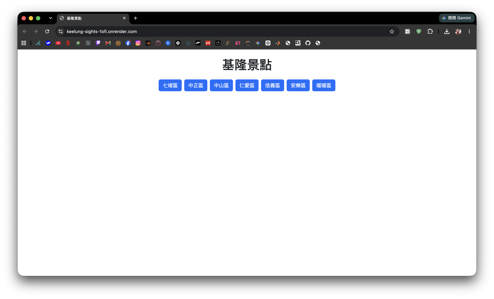
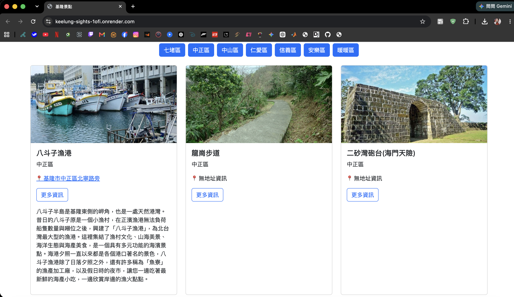
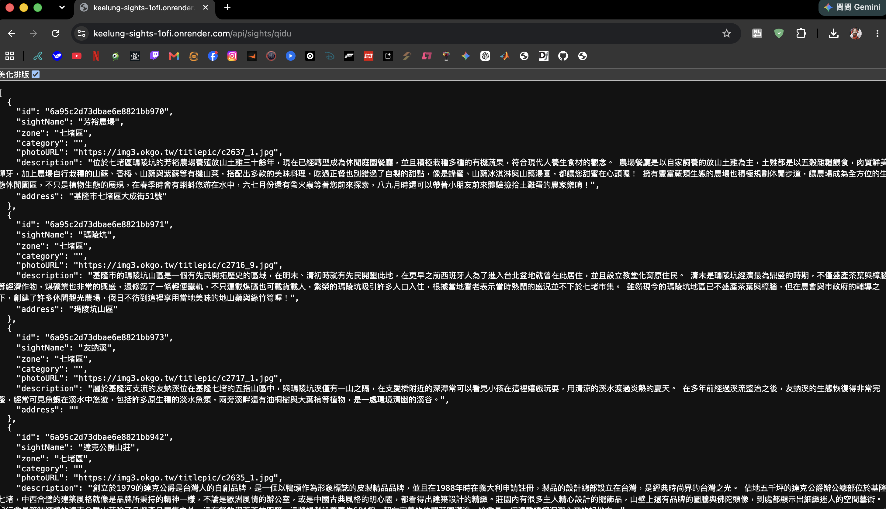
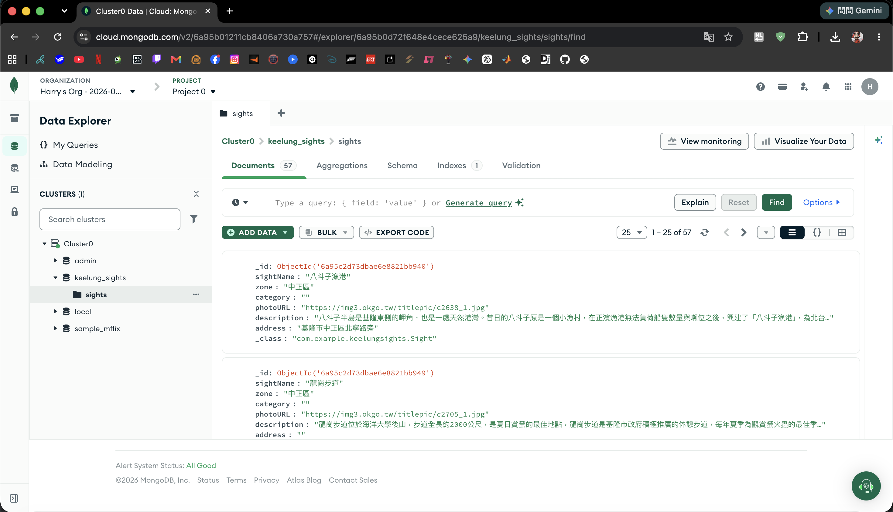
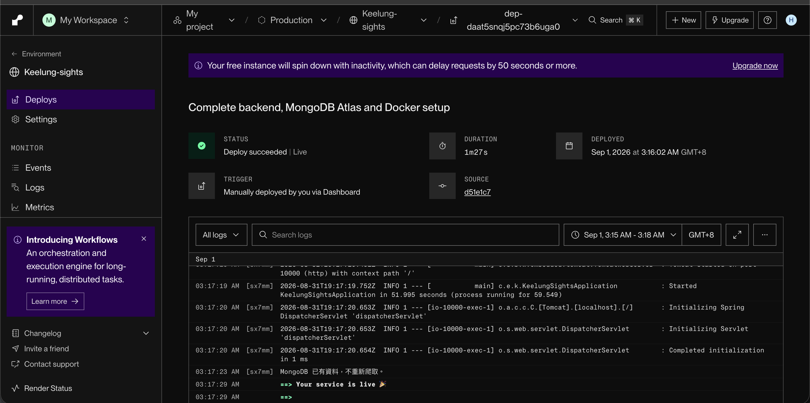

# Keelung Sights

基隆市景點查詢網站。

本專案使用 Java Spring Boot 建立後端系統，並使用 Jsoup 爬取基隆市景點資料。
爬取後的景點資料會儲存在 MongoDB Atlas，並透過 REST API 提供前端查詢。

前端使用 HTML、CSS、JavaScript 與 Bootstrap 建立響應式網頁，
使用者可以依照基隆市不同行政區查詢景點、查看景點詳細資訊，
並透過 Google Maps 搜尋景點位置。

系統使用 Docker 容器化，並部署至 Render。

---

## Online Demo

### 公開網站

https://keelung-sights-1ofi.onrender.com

### API 範例

https://keelung-sights-1ofi.onrender.com/api/sights/qidu

### GitHub Repository

https://github.com/H4RRY56/Keelung-sights

---

# 系統功能

- 使用 Jsoup 爬取基隆市景點資料
- 將爬取結果轉換為 `Sight` JavaBean
- 將景點資料儲存至 MongoDB Atlas
- 提供 REST API 查詢各行政區景點
- 支援基隆市七個行政區查詢
- 不合法的行政區輸入回傳 HTTP 404
- 使用 Bootstrap 建立 RWD 響應式網頁
- 顯示景點名稱、行政區、圖片與景點介紹
- 可展開查看景點詳細資訊
- 無圖片或介紹時提供替代顯示內容
- 可透過 Google Maps 搜尋景點位置
- 使用 Docker 建立應用程式容器
- 使用 Render 部署公開網站

---

# 支援行政區

| API Code | 行政區 |
| --- | --- |
| `qidu` | 七堵區 |
| `zhongzheng` | 中正區 |
| `zhongshan` | 中山區 |
| `renai` | 仁愛區 |
| `xinyi` | 信義區 |
| `anle` | 安樂區 |
| `nuannuan` | 暖暖區 |

---

# 系統架構

本系統主要分為資料爬取、資料儲存、後端 API 與前端顯示四個部分。

```text
OKGO 景點網站
      |
      v
KeelungSightsCrawler
      |
      v
Sight
      |
      v
MongoDB Atlas
      |
      v
SightRepository
      |
      v
SightService
      |
      v
SightController
      |
      v
REST API
      |
      v
HTML / CSS / JavaScript / Bootstrap
      |
      v
使用者瀏覽器
```

## 架構說明

### KeelungSightsCrawler

使用 Jsoup 讀取景點網站資料，
並將取得的資料轉換成 `Sight` 物件。

Crawler 會處理景點名稱、行政區、圖片、描述與地址等資料，
並加入錯誤處理，避免單一景點頁面讀取失敗時造成整個爬蟲中斷。

### Sight

`Sight` 為系統中的景點資料模型。

主要包含以下欄位：

- `sightName`
- `zone`
- `category`
- `photoURL`
- `description`
- `address`

同時也是 MongoDB 儲存景點資料時使用的 Document Model。

### MongoDB Atlas

MongoDB Atlas 負責儲存所有景點資料。

應用程式啟動時會先檢查 MongoDB 是否已有資料。

```text
資料庫為空
    ↓
執行 Crawler
    ↓
取得景點資料
    ↓
儲存至 MongoDB Atlas
```

如果資料庫中已經存在資料：

```text
MongoDB 已有資料
    ↓
不重新執行爬蟲
```

### SightRepository

使用 Spring Data MongoDB 與 MongoDB 溝通，
負責景點資料的存取以及依行政區查詢景點。

### SightService

負責系統邏輯與行政區代碼轉換。

例如：

```text
qidu
↓
七堵區
```

如果輸入不存在的行政區代碼，
系統會回傳 HTTP 404 Not Found。

### SightController

負責接收 HTTP Request，並提供 REST API：

```http
GET /api/sights/{zone}
```

### Frontend

前端使用：

- HTML
- CSS
- JavaScript
- Bootstrap

JavaScript 會呼叫後端 REST API，
並將取得的 JSON 景點資料轉換成景點卡片顯示。

### Docker / Render

Spring Boot 專案使用 Docker 建立 Container，
最後部署至 Render，提供公開網站服務。

---

# 專案結構

```text
Keelung-sights/
│
├── README.md
├── .gitignore
├── docs/
│   └── images/
│       ├── homepage.png
│       ├── detail.png
│       ├── api.png
│       ├── mongodb.png
│       └── render.png
│
└── backend/
    ├── Dockerfile
    ├── .dockerignore
    ├── pom.xml
    │
    └── src/
        └── main/
            ├── java/
            │   └── com/example/keelungsights/
            │       ├── KeelungSightsApplication.java
            │       ├── KeelungSightsCrawler.java
            │       ├── Sight.java
            │       ├── SightController.java
            │       ├── SightService.java
            │       ├── SightRepository.java
            │       └── DataInitializer.java
            │
            └── resources/
                ├── application.properties
                │
                └── static/
                    ├── index.html
                    ├── app.js
                    └── style.css
```

---

# 開發環境與技術版本

## Backend

- Java / JDK：21
- Spring Boot：3.5.16
- Maven：3.9.16
- Jsoup：1.22.2
- Spring Web
- Spring Data MongoDB
- MongoDB Java Driver：5.5.2

## Frontend

- HTML
- CSS
- JavaScript
- Bootstrap
- Node.js：未使用

## Database

- MongoDB
- MongoDB Atlas

## Deployment

- Docker
- Render

## Development Tool

- IntelliJ IDEA

---

# 景點資料模型

每個景點主要包含以下資料：

| Field | 說明 |
| --- | --- |
| `sightName` | 景點名稱 |
| `zone` | 所屬行政區 |
| `category` | 景點分類 |
| `photoURL` | 景點圖片網址 |
| `description` | 景點介紹 |
| `address` | 景點地址 |

---

# 安裝與執行

## 1. Clone 專案

將專案從 GitHub 下載到本機：

```bash
git clone https://github.com/H4RRY56/Keelung-sights.git
```

進入後端專案資料夾：

```bash
cd Keelung-sights/backend
```

---

## 2. 環境需求

執行本專案前，請先確認已安裝：

- JDK 21
- Maven
- MongoDB Atlas 帳號與 Cluster
- Docker（若使用 Docker 執行）

---

## 3. MongoDB Atlas 設定

本專案使用 MongoDB Atlas 作為資料庫。

系統需要以下環境變數：

```text
MONGODB_URI
```

`application.properties`：

```properties
spring.data.mongodb.uri=${MONGODB_URI}
spring.data.mongodb.database=keelung_sights
server.port=${PORT:8080}
```

請使用自己的 MongoDB Atlas Connection String。

Connection String 格式例如：

```text
mongodb+srv://<username>:<password>@<cluster-host>/
```

請勿將真正的：

- MongoDB 帳號
- MongoDB 密碼
- Connection String
- `.env`
- Token

上傳至 GitHub。

---

## 4. 使用 Maven 執行

macOS / Linux 可以先設定環境變數：

```bash
export MONGODB_URI="你的 MongoDB Atlas Connection String"
```

接著在 `backend` 目錄執行：

```bash
mvn spring-boot:run
```

啟動成功後開啟：

```text
http://localhost:8080
```

API：

```text
http://localhost:8080/api/sights/qidu
```

第一次啟動時，如果 MongoDB 中尚未有景點資料，
系統會執行爬蟲並將景點資料寫入 MongoDB。

如果資料庫中已存在資料，
則不會重新執行爬蟲。

---

## 5. 使用 Docker 執行

在 `backend` 目錄建立：

```text
.env
```

內容：

```text
MONGODB_URI=<your MongoDB Atlas connection string>
```

`.env` 已加入 `.gitignore`，
不可上傳至 GitHub。

建立 Docker Image：

```bash
docker build -t keelung-sights .
```

執行 Container：

```bash
docker run \
  --name keelung-sights-app \
  --env-file .env \
  -p 8080:8080 \
  keelung-sights
```

啟動成功後開啟：

```text
http://localhost:8080
```

API：

```text
http://localhost:8080/api/sights/qidu
```

若要停止目前正在前景執行的 Container：

```text
Ctrl + C
```

再次啟動已建立的 Container：

```bash
docker start -a keelung-sights-app
```

刪除 Container：

```bash
docker rm keelung-sights-app
```

---

## 6. Render 部署

本專案使用 Render 進行雲端部署。

主要設定：

```text
Branch: main
Root Directory: backend
Runtime: Docker
```

Render 的 Environment Variables 需要設定：

```text
MONGODB_URI
```

Value 為 MongoDB Atlas Connection String。

MongoDB Atlas 的 Network Access 必須允許 Render 服務的 Outbound IP，
否則 Render 無法連線至 MongoDB Atlas。

部署完成後可透過以下網址存取：

```text
https://keelung-sights-1ofi.onrender.com
```

---

# API

## 查詢指定行政區景點

```http
GET /api/sights/{zone}
```

例如查詢七堵區：

```http
GET /api/sights/qidu
```

本機：

```text
http://localhost:8080/api/sights/qidu
```

公開 API：

```text
https://keelung-sights-1ofi.onrender.com/api/sights/qidu
```

## JSON Response 範例

```json
[
  {
    "sightName": "景點名稱",
    "zone": "七堵區",
    "category": "",
    "photoURL": "圖片網址",
    "description": "景點介紹",
    "address": "景點地址"
  }
]
```

---

## 錯誤行政區

如果輸入不存在的行政區：

```http
GET /api/sights/abc
```

系統會回傳：

```text
HTTP 404 Not Found
```

公開 API：

```text
https://keelung-sights-1ofi.onrender.com/api/sights/abc
```

---

# 測試方式

## API 測試

### 正常行政區

開啟：

```text
http://localhost:8080/api/sights/qidu
```

預期結果：

```text
HTTP 200 OK
```

並回傳七堵區景點 JSON。

### 錯誤行政區

開啟：

```text
http://localhost:8080/api/sights/abc
```

預期結果：

```text
HTTP 404 Not Found
```

---

## 前端功能測試

確認以下七個行政區皆可正常取得景點：

- 七堵區
- 中正區
- 中山區
- 仁愛區
- 信義區
- 安樂區
- 暖暖區

並確認：

- 景點名稱正常顯示
- 景點行政區正常顯示
- 景點圖片正常顯示
- 景點介紹可以展開與收合
- 沒有圖片時可以正常顯示提示
- 沒有描述時可以正常顯示提示
- Google Maps 按鈕可以正常開啟
- 桌面版每列顯示三張景點卡片
- 行動裝置每列顯示一張景點卡片

JUnit 自動化測試完成後，可再於此處補充測試方式。

---

# Google Maps

景點卡片中的地址按鈕使用：

```text
基隆市 + 景點名稱
```

作為 Google Maps 搜尋內容。

例如：

```text
基隆市 泰安瀑布
```

這樣即使來源網站沒有提供完整地址，
仍可利用景點名稱搜尋位置。

---

# RWD Responsive Web Design

本專案使用 Bootstrap Grid 建立響應式版面。

桌面裝置：

```text
每列 3 張景點卡片
```

行動裝置：

```text
每列 1 張景點卡片
```

景點詳細資訊使用 Bootstrap Collapse 顯示與收合。

---

# Environment Variables

本專案使用以下環境變數：

| Variable | 說明 |
| --- | --- |
| `MONGODB_URI` | MongoDB Atlas Connection String |
| `PORT` | Web Server Port，未設定時預設使用 8080 |

請勿將真正的 `MONGODB_URI` 上傳至 GitHub。

---

# Screenshots

專案截圖存放於：

```text
docs/images/
```

---

## Homepage

基隆景點查詢網站首頁與行政區選擇功能。



---

## Sight Detail

景點詳細資訊展開畫面。



---

## REST API

REST API 回傳景點 JSON 資料。



---

## MongoDB Atlas

景點資料儲存在 MongoDB Atlas 的 `keelung_sights` Database 與 `sights` Collection。



---

## Render Deployment

Dockerized Spring Boot Application 成功部署至 Render。



---

# Known Limitations

- 景點資料來源為第三方網站，如果來源網站 HTML 結構改變，Crawler 使用的 CSS Selector 可能需要同步修改。
- 部分景點可能沒有圖片、地址或完整描述，系統會以空值或提示文字處理。
- 目前資料來源沒有穩定且明確的景點分類欄位，因此部分景點的 `category` 可能為空值。
- MongoDB Atlas 必須正確設定 Network Access，否則部署環境可能無法連線資料庫。
- Render 免費服務在一段時間沒有使用後可能進入休眠，因此第一次開啟網站時可能需要等待服務重新啟動。

---

# Security

本專案不會將以下敏感資料提交至 GitHub：

```text
.env
MongoDB Password
MongoDB Connection String
Access Token
```

`.gitignore` 已設定忽略 `.env`。

正式的資料庫連線資訊會透過環境變數：

```text
MONGODB_URI
```

提供給 Spring Boot、Docker 與 Render 使用。
